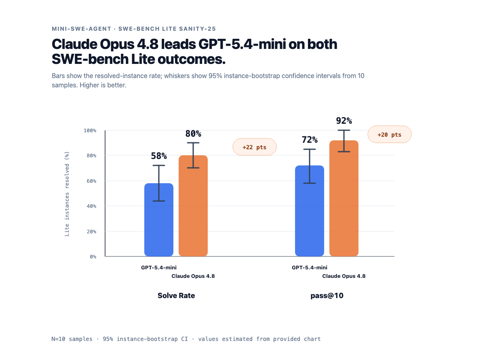
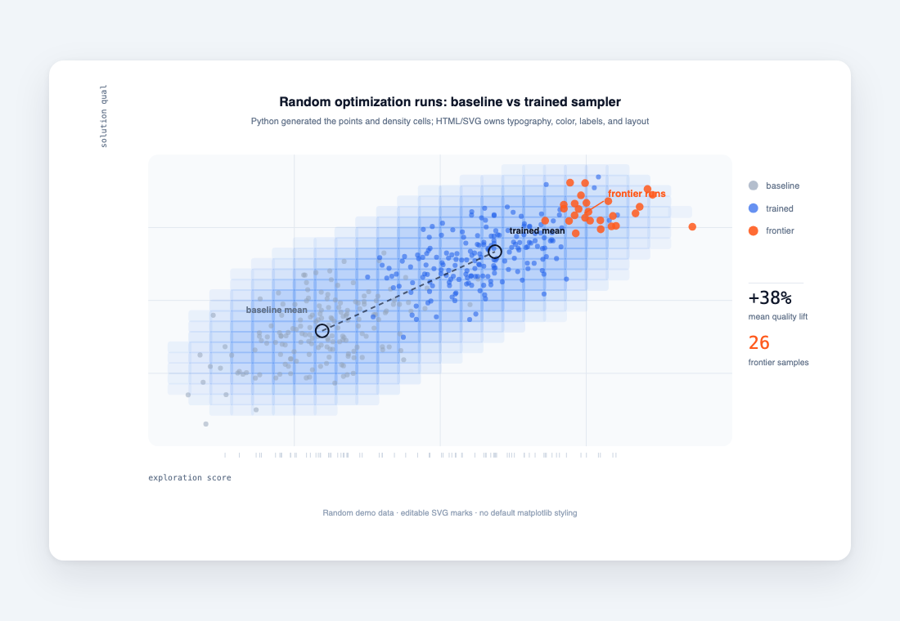
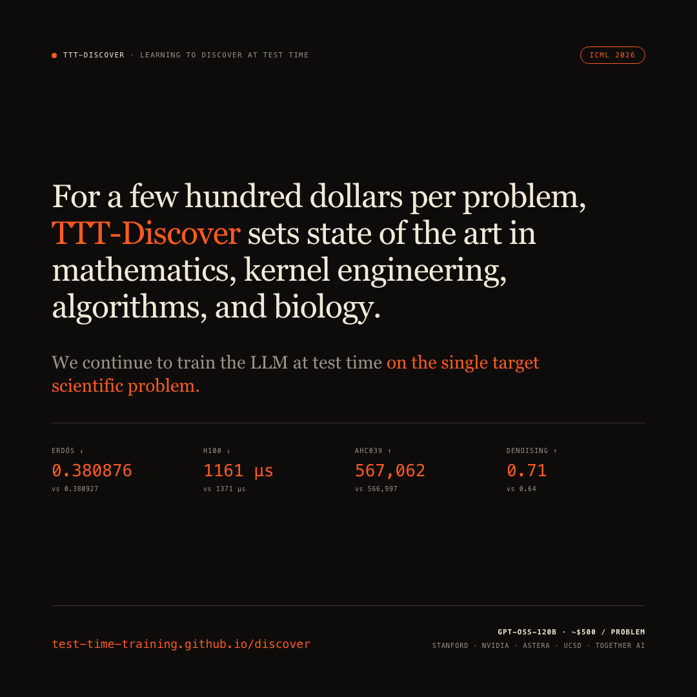

# Design Good Figures

A Cursor Agent Skill for designing scientific posters, slide decks, publication figures, plots, diagrams, and benchmark visuals in HTML/SVG.

The goal is simple: make research visuals that are clear enough for experts, polished enough for public presentation, and still editable as code.

## Gallery

<table>
  <tr>
    <td></td>
    <td></td>
    <td></td>
  </tr>
  <tr>
    <td><sub>Benchmark card with uncertainty</sub></td>
    <td><sub>Complex plot with generated geometry</sub></td>
    <td><sub>Claim-first research poster</sub></td>
  </tr>
</table>

## What This Skill Helps With

- Research posters with one strong claim and clear supporting evidence
- Multi-slide talk decks built as a sequence of single-claim slides
- Publication figures built as editable HTML/SVG
- Benchmark comparison plots
- Outcome matrices and small multiples
- Annotated screenshots
- Complex plots where Python generates geometry and HTML/SVG handles design
- PDF/PNG export workflows, for single canvases and per-slide decks

The skill combines practical HTML/SVG templates, Tufte-style plotting principles, execution-discipline rules (a verify loop, SVG containment, diagram hygiene), contained examples, and small support scripts.

## Install In Cursor

In Cursor:

1. Open `Settings`
2. Go to `Rules`
3. Click `Add Rule`
4. Choose `Remote Rule (GitHub)`
5. Enter:

```text
https://github.com/vinid/good-design
```

Cursor should discover the skill from `SKILL.md`.

Manual install:

```bash
mkdir -p ~/.cursor/skills
git clone https://github.com/vinid/good-design ~/.cursor/skills/good-design
```

## Install For Other Agents

`good-design` follows the Agent Skills format: a directory with `SKILL.md` frontmatter plus optional `references/`, `scripts/`, `examples/`, and `data/` folders. That makes it portable to agents that support Agent Skills.

With the Agent Skills CLI:

```bash
npx skills add vinid/good-design --agent cursor
npx skills add vinid/good-design --agent claude-code
npx skills add vinid/good-design --agent codex
```

Manual project installs:

```bash
git clone https://github.com/vinid/good-design .agents/skills/good-design
git clone https://github.com/vinid/good-design .cursor/skills/good-design
git clone https://github.com/vinid/good-design .claude/skills/good-design
git clone https://github.com/vinid/good-design .codex/skills/good-design
```

Manual global installs:

```bash
git clone https://github.com/vinid/good-design ~/.agents/skills/good-design
git clone https://github.com/vinid/good-design ~/.cursor/skills/good-design
git clone https://github.com/vinid/good-design ~/.claude/skills/good-design
git clone https://github.com/vinid/good-design ~/.codex/skills/good-design
```

Cursor also discovers compatible skills from `.agents/skills/`, `.claude/skills/`, `.codex/skills/`, and their user-level equivalents.

## Repository Structure

```text
.
├── SKILL.md
├── references/
│   ├── analytical-design.md
│   ├── design-principles.md
│   ├── examples.md
│   ├── execution-discipline.md
│   ├── export-recipes.md
│   ├── figure-shells.md
│   ├── plot-templates.md
│   ├── poster-templates.md
│   ├── slide-decks.md
│   └── tufte-principles.md
├── examples/
│   ├── figure_runtime.html
│   ├── fraud_instruction_variants.html
│   ├── grounded_fraud_instruction_variants.html
│   ├── grounded_fraud_instruction_variants.pdf
│   ├── outcome_matrix.html
│   ├── random_complex_plot.html
│   ├── random_complex_plot.png
│   ├── random_ridgeline_plot.html
│   ├── research_poster.html
│   ├── research_poster.png
│   ├── swe_bench_lite_comparison.html
│   ├── swe_bench_lite_comparison.png
│   ├── ttt_talk_editorial/        # full Reveal.js deck (one example, not a template)
│   └── vocal_cue_detection.html
├── scripts/
│   ├── export_pdf.py
│   ├── generate_fraud_instruction_variants.py
│   └── generate_ridgeline_demo.py
└── data/
    └── fraud_instruction_variants.csv
```

## Design Philosophy

Good figures should answer:

- What is the claim?
- Compared to what?
- What is the evidence?
- Can the viewer verify the scale, units, and baseline?
- Did design clarify the data, or decorate it?

Taste is necessary but not sufficient. Most "looks broken" moments are mechanical, not aesthetic — marks leaking out of their boxes, colliding labels, a "best" mark that contradicts its own encoding. The skill treats verification as a tight loop: edit one figure or slide, screenshot it at final size, look at the image (not the code), fix what it reveals, repeat. The rendered image is the source of truth.

For complex plots, use Python as a geometry engine, not as the art director:

1. Python computes points, densities, layouts, contours, or paths.
2. The output remains editable HTML/SVG.
3. Typography, spacing, color, labels, annotations, and export are handled in the figure shell.

## Included Examples

### Benchmark Comparison

`examples/swe_bench_lite_comparison.html` is a compact benchmark-card example: a claim-first title, grouped bars, visible uncertainty, direct value labels, and a source note in one export-ready HTML/SVG file. The gallery preview is a transparent PNG generated from that HTML.

Open these directly in a browser:

- `examples/swe_bench_lite_comparison.html`
- `examples/research_poster.html`
- `examples/outcome_matrix.html`
- `examples/random_complex_plot.html`
- `examples/random_ridgeline_plot.html`
- `examples/grounded_fraud_instruction_variants.html`
- `examples/ttt_talk_editorial/index.html` — a full Reveal.js talk deck. This is **one example, not a template**: copy the discipline (sequence, one claim per slide, shared shell, stable color), not the editorial styling. Decks do not need to look like this.

The grounded example is generated from:

```text
data/fraud_instruction_variants.csv
```

Regenerate it with:

```bash
python scripts/generate_fraud_instruction_variants.py
```

## Export To PDF

Use the contained PDF exporter:

```bash
python scripts/export_pdf.py examples/grounded_fraud_instruction_variants.html examples/grounded_fraud_instruction_variants.pdf
```

The exporter uses headless Chrome or Chromium.

## When To Use The Skill

Use this skill when asking Cursor to:

- design a new scientific figure
- critique a figure
- recreate a paper plot as editable SVG
- make a research poster
- build or critique a slide deck
- improve a benchmark chart
- generate a plot from data
- export a figure or deck to PDF

## Rule Of Thumb

If the plot is simple, write SVG directly.

If the plot is complex, generate the geometry with a script, then finish the figure in HTML/SVG.

If it is only a PNG crop, it is not an editable figure.
